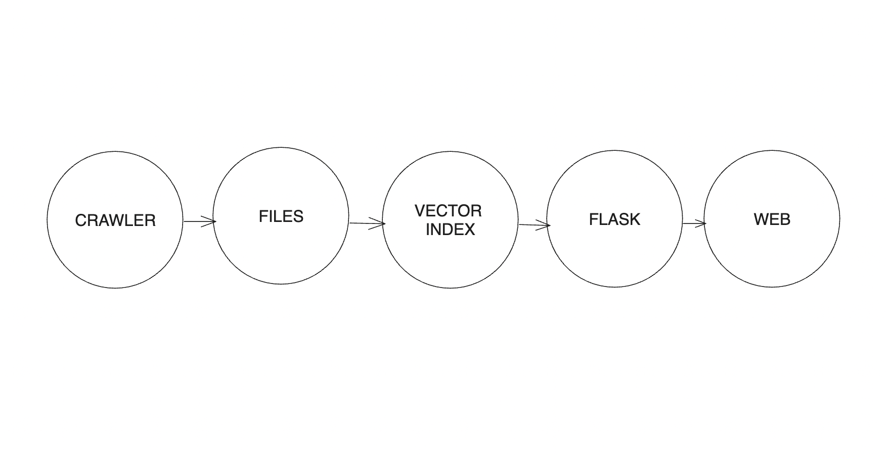
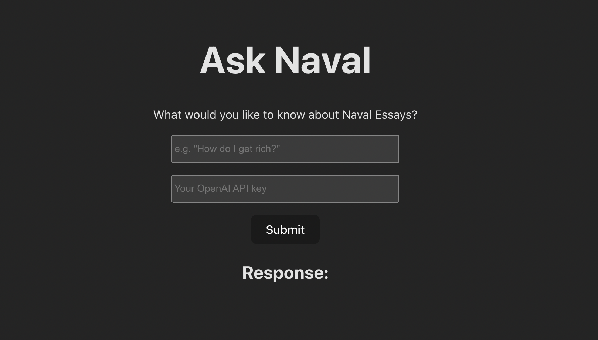

# Monorepo llama Index
A monorepo to index essays and articles ob LLMs

## Crawler
Reponsible for get a webpage, download all the content there and store on examples folder.

### How to run
To create essays we identify all the websites on `config.json` file and after run `yarn crawler` we get all the anchor links on the provided url to download every link there, so provide pages that preferable only have articles and nothing more.

1. Add the blog on `config.json` files, preferable the page with the list of articles/essays.
2. run `yarn crawler`

## API
Interact with the LLM through the API
## Web

